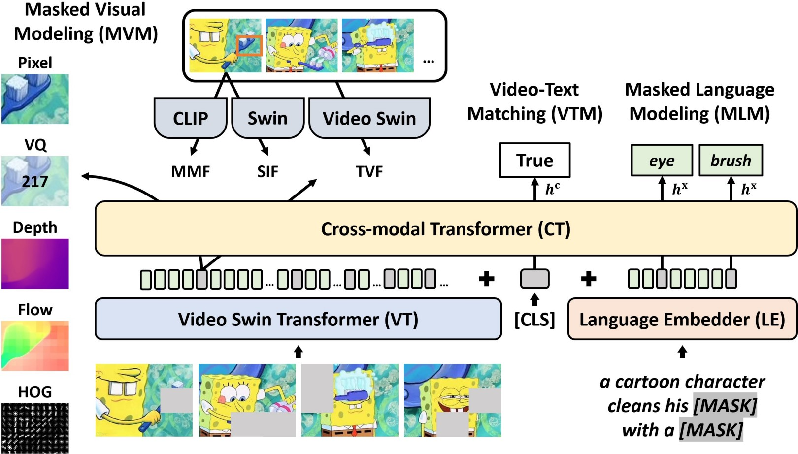

# [CVPR'23] An Empirical Study of End-to-End Video-Language Transformers with Masked Visual Modeling
A PyTorch implementation of [EmpiricalMVM](https://tsujuifu.github.io/pubs/cvpr23_empirical-mvm.pdf)

[Paper](https://tsujuifu.github.io/pubs/cvpr23_empirical-mvm.pdf) | [Slide](https://tsujuifu.github.io/slides/cvpr23_empirical-mvm.pdf) | [Video](https://youtu.be/T1qTkcMCq1k)



## Overview
EmpiricalMVM is an implementation of <br>
"[An Empirical Study of End-to-End Video-Language Transformers with Masked Visual Modeling](https://tsujuifu.github.io/pubs/cvpr23_empirical-mvm.pdf)" <br>
[Tsu-Jui Fu*](https://scholar.google.com/citations?user=7QRDcC0AAAAJ), [Linjie Li*](https://scholar.google.com/citations?user=WR875gYAAAAJ), [Zhe Gan](https://scholar.google.com/citations?user=E64XWyMAAAAJ), [Kevin Lin](https://scholar.google.com/citations?user=LKSy1kwAAAAJ), [William Yang Wang](https://scholar.google.com/citations?user=gf8Ms_8AAAAJ), [Lijuan Wang](https://scholar.google.com/citations?user=cDcWXuIAAAAJ), and [Zicheng Liu](https://scholar.google.com/citations?user=bkALdvsAAAAJ) <br>
in Conference on Computer Vision and Pattern Recognition (**CVPR**) 2023

We systematically **examine the potential of MVM in the context of VidL learning**. Specifically, we base our study on a fully end-to-end VIdeO-LanguagE Transformer ([VIOLET](https://tsujuifu.github.io/pubs/arxiv_violet.pdf)), where the supervision from MVM training can be backpropogated to the video pixel space. In total, eight different reconstructive targets of MVM are explored, **from low-level pixel values and oriented gradients to high-level depth maps, optical flow, discrete visual tokens and latent visual features**. We conduct comprehensive experiments and provide insights into the factors leading to effective MVM training, resulting in an enhanced model VIOLETv2.

## Requirements
This code is implemented under **Python 3.9**, [PyTorch 1.11](https://pypi.org/project/torch/1.11.0), [TorchVision 0.12](https://pypi.org/project/torchvision/0.12.0).
+ [tqdm](https://pypi.org/project/tqdm), [scikit-image](https://pypi.org/project/scikit-image), [cv2](https://pypi.org/project/opencv-python)
+ [CLIP](https://github.com/openai/CLIP), [DALL-E](https://github.com/openai/DALL-E)
+ [Transformers](https://pypi.org/project/transformers), [FairScale](https://pypi.org/project/fairscale)
+ [DeepSpeed](https://pypi.org/project/deepspeed)

## Usage
### Pretraining
Download [pretraining datasets](https://drive.google.com/drive/u/1/folders/1AR1NooeNVhx5o1Lt5oGLW7z_Ogu-ezgm) ([WebVid2.5M](https://m-bain.github.io/webvid-dataset) & [CC3M](https://github.com/google-research-datasets/conceptual-captions)) and pretrain via **single-node multi-gpu** distributed training.
```
# edit "mvm_target" in args_pretrain.json # "3d_feature", "2d_feature", "2d_clip_feature", "pixel", "hog", "optical_flow", "depth", "vq"
CUDA_VISIBLE_DEVICES='0,1,2,3,4,5,6,7' LOCAL_SIZE='8' python -m torch.distributed.launch --nproc_per_node=8 --master_port=5566 main_pretrain_yaml.py --config _args/args_pretrain.json
```
We provide [ablation pretrained checkpoints](https://drive.google.com/drive/u/1/folders/1QgxhnRy8Pmyhg65kh0Q80DNn4UVkf5tA) (Table 1 & 6).

### Downstream
Download [downstream datasets](https://drive.google.com/drive/u/1/folders/1wtOsfrSFkGc4kdLQIwOWCEw6gS4aZSvv) and our [best pretrained checkpoint](https://drive.google.com/file/d/1KgC1rjXzjUVQWKpRT5-bhUDLUGAuoJgl).
+ Multiple-Choice Question Answering ([TGIF-Action](https://github.com/YunseokJANG/tgif-qa), [TGIF-Transition](https://github.com/YunseokJANG/tgif-qa), [MSRVTT-MC](https://github.com/albanie/collaborative-experts/tree/master/misc/datasets/msrvtt), and [LSMDC-MC](https://github.com/yj-yu/lsmdc))
```
CUDA_VISIBLE_DEVICES='0,1,2,3' python -m torch.distributed.launch --nproc_per_node=4 --master_port=5566 main_qamc_tsv_mlm_gen_ans_idx.py --config _args/args_tgif-action.json
CUDA_VISIBLE_DEVICES='0,1,2,3' python -m torch.distributed.launch --nproc_per_node=4 --master_port=5566 main_qamc_tsv_mlm_gen_ans_idx.py --config _args/args_tgif-transition.json
CUDA_VISIBLE_DEVICES='0,1,2,3' python -m torch.distributed.launch --nproc_per_node=4 --master_port=5566 main_qamc_tsv.py --config _args/args_msrvtt-mc.json
CUDA_VISIBLE_DEVICES='0,1,2,3' python -m torch.distributed.launch --nproc_per_node=4 --master_port=5566 main_qamc_tsv.py --config _args/args_lsmdc-mc.json
```
+ Open-Ended Question Answering ([TGIF-Frame](https://github.com/YunseokJANG/tgif-qa), [MSRVTT-QA](https://github.com/xudejing/video-question-answering), [MSVD-QA](https://github.com/xudejing/video-question-answering), and [LSMDC-FiB](https://github.com/yj-yu/lsmdc))
```
CUDA_VISIBLE_DEVICES='0,1,2,3' python -m torch.distributed.launch --nproc_per_node=4 --master_port=5566 main_qaoe_tsv_mlm_head.py --config _args/args_tgif-frame.json
CUDA_VISIBLE_DEVICES='0,1,2,3' python -m torch.distributed.launch --nproc_per_node=4 --master_port=5566 main_qaoe_tsv_mlm_head.py --config _args/args_msrvtt-qa.json
CUDA_VISIBLE_DEVICES='0,1,2,3' python -m torch.distributed.launch --nproc_per_node=4 --master_port=5566 main_qaoe_tsv_mlm_head.py --config _args/args_msvd-qa.json
CUDA_VISIBLE_DEVICES='0,1,2,3' python -m torch.distributed.launch --nproc_per_node=4 --master_port=5566 main_qaoe_tsv_lsmdc_fib.py --config _args/args_lsmdc-fib.json
```
+ Text-to-Video Retrieval ([MSRVTT](https://github.com/albanie/collaborative-experts/tree/master/misc/datasets/msrvtt), [DiDeMo](https://github.com/LisaAnne/TemporalLanguageRelease), and [LSMDC](https://github.com/yj-yu/lsmdc))
```
CUDA_VISIBLE_DEVICES='0,1,2,3' python -m torch.distributed.launch --nproc_per_node=4 --master_port=5566 main_retrieval_tsv.py --config _args/args_msrvtt-retrieval.json
CUDA_VISIBLE_DEVICES='0,1,2,3' python eval_retrieval_tsv.py --config _args/args_msrvtt-retrieval.json
CUDA_VISIBLE_DEVICES='0,1,2,3' python -m torch.distributed.launch --nproc_per_node=4 --master_port=5566 main_retrieval_tsv.py --config _args/args_didemo-retrieval.json
CUDA_VISIBLE_DEVICES='0,1,2,3' python eval_retrieval_tsv.py --config _args/args_didemo-retrieval.json
CUDA_VISIBLE_DEVICES='0,1,2,3' python -m torch.distributed.launch --nproc_per_node=4 --master_port=5566 main_retrieval_tsv.py --config _args/args_lsmdc-retrieval.json
CUDA_VISIBLE_DEVICES='0,1,2,3' python eval_retrieval_tsv.py --config _args/args_lsmdc-retrieval.json
```
We also provide our [best downstream checkpoints](https://drive.google.com/drive/u/1/folders/1HF9qeBMRsP0rnp_vVuBeUwFf9r7KE_92) (Table 8 & 9).

### Results on CUDA 11.5 Python 3.9 PyTorch 1.11 Transformers 4.26
| | TGIF-Action | TGIF-Transition | MSRVTT-MC | LSMDC-MC |
| :-: | :-: | :-: | :-: | :-: |
| Paper | 94.8 | 99.0 | 97.6 | 84.4 |
| Repo | 94.9 | 99.0 | 96.8 | 84.4 |

| | TGIF-Frame | MSRVTT-QA | MSVD-QA | LSMDC-FiB |
| :-: | :-: | :-: | :-: | :-: |
| Paper | 72.8 | 44.5 | 54.7 | 56.9 |
| Repo | 72.7 | 44.5 | 54.6  | 56.9 |

| | MSRVTT-T2V | DiDeMo-T2V | LSMDC-T2V |
| :-: | :-: | :-: | :-: |
| Paper | 37.2 / 64.8 / 75.8 | 47.9 / 76.5 / 84.1 | 24.0 / 43.5 / 54.1 |
| Repo | 36.3 / 64.9 / 75.5 | 46.0 / 74.1 / 83.9 | 25.1 / 44.2 / 54.9 |

## Citation
```
@inproceedings{fu2023empirical-mvm, 
  author = {Tsu-Jui Fu* and Linjie Li* and Zhe Gan and Kevin Lin and William Yang Wang and Lijuan Wang and Zicheng Liu}, 
  title = {{An Empirical Study of End-to-End Video-Language Transformers with Masked Visual Modeling}}, 
  booktitle = {Conference on Computer Vision and Pattern Recognition (CVPR)}, 
  year = {2023} 
}
```
```
@inproceedings{fu2021violet, 
  author = {Tsu-Jui Fu and Linjie Li and Zhe Gan and Kevin Lin and William Yang Wang and Lijuan Wang and Zicheng Liu}, 
  title = {{VIOLET: End-to-End Video-Language Transformers with Masked Visual-token Modeling}}, 
  booktitle = {arXiv:2111.1268}, 
  year = {2021} 
}
```
